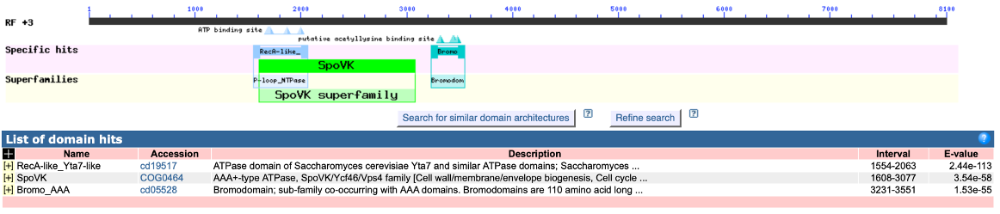
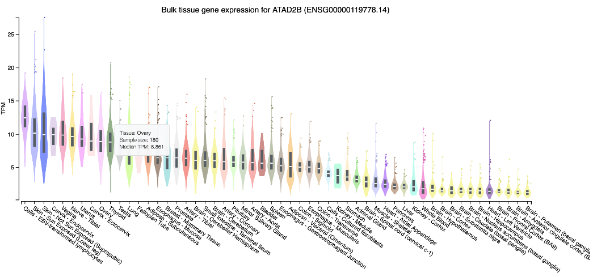
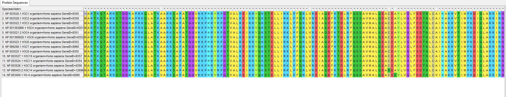
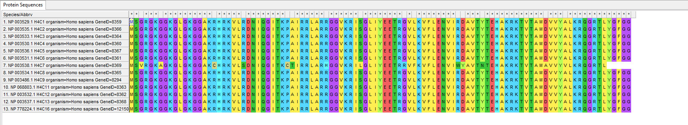
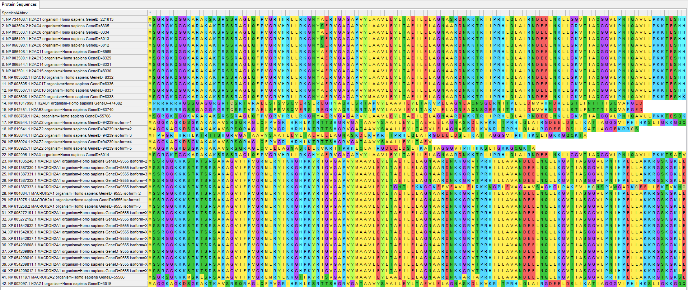
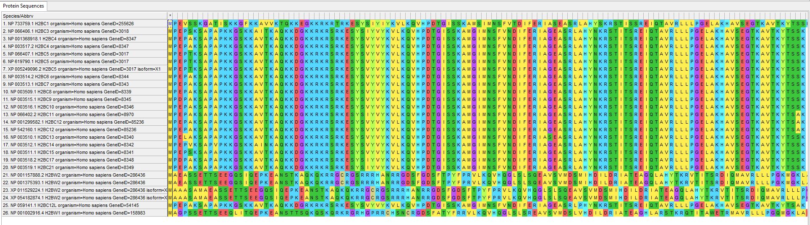
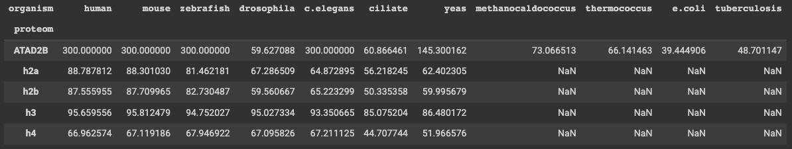
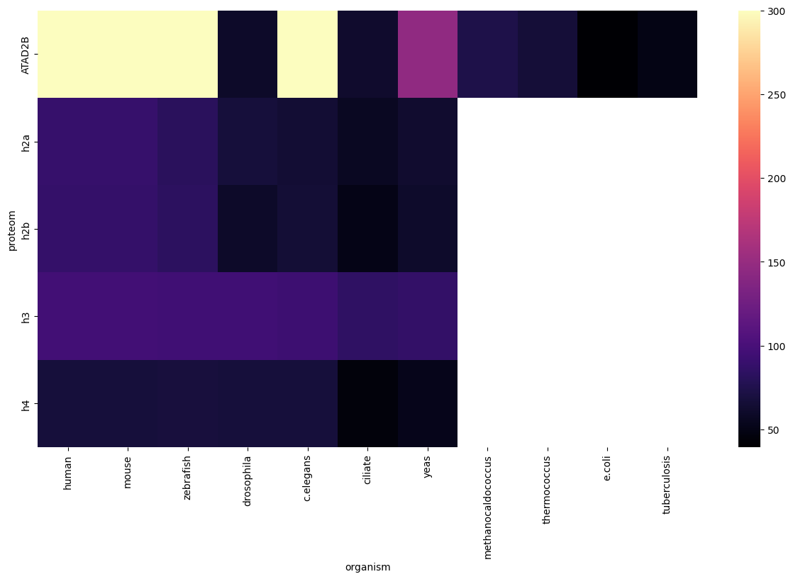

# Аксёнов Ярослав (hse23 project)

[Ссылка на ноутбук](https://colab.research.google.com/drive/1rkvxMxCkIijUqFwdPCbj6aJ7DWWSwGVi?usp=sharing)

## Описание белка
Белок, кодируемый этим геном, принадлежит к семейству атфаз AAA. Этот член семейства включает в себя N-концевой бромодомен. Было [обнаружено](https://pubs.acs.org/doi/abs/10.1021/acs.jmedchem.0c01178), что он локализован в ядре, частично в местах репликации, что согласуется с функцией, связанной с хроматином

Функция белка: [histone modification read](https://pubmed.ncbi.nlm.nih.gov/26365797/).

Связь с гистоновой меткой H2A раскрыта в данной [статье](https://pubs.acs.org/doi/abs/10.1021/acs.jmedchem.0c01178):

`
We show that the ATAD2B bromodomain recognizes mono- and diacetyllysine modifications on histones H4 and H2A.
` 

## Доменная структура

## Графики экспрессии

## Выравнивание гистонов

### H3

### H4

### H2A

### H2B

Для H2A и H2B последовательности практически одинаковы, значит они кодируют один и тот же ген, то же самое и для H3 и H4. Но у H2A и H2B часть последовательностей отличается, скорее всего они кодируют ген с другим строением, выполняющий схожие функции.

## E-value
Там где NaN не было хитов

### -log10 e-value:

### Heatmap хитов

## Выводы
Белок очень слабо проявился в бактериях и археях, поэтому в качестве вывода можно сказать, что белок впервые появился 1,5—2 млрд лет назад у одноклеточных эукариот.